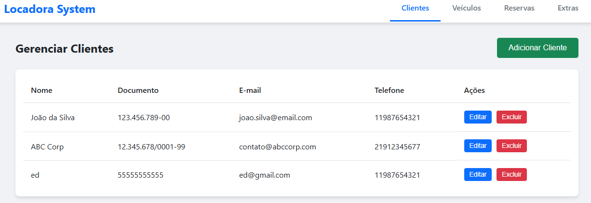
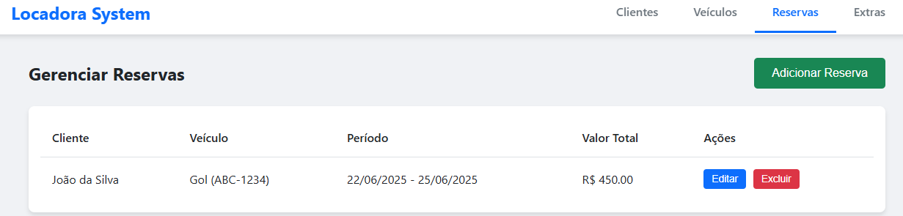
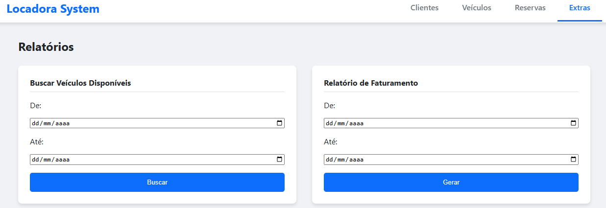

# Protótipo de Alta Fidelidade & Interface do Sistema

## 1. Introdução

O protótipo de alta fidelidade foi desenvolvido com o objetivo de representar visualmente a interface final do sistema **Gestão de Locadora de Veículos**. Diferente de um protótipo estático feito em ferramentas de design, esta versão é o próprio **frontend funcional** da aplicação, desenvolvido com HTML, CSS e JavaScript. Foi desenvolvido utilizando a feramenta [Figma](https://www.figma.com/).

Este artefato é essencial para validar a experiência do usuário (UX), testar o fluxo completo das funcionalidades e servir como uma representação fiel do produto final. Ele permite que a equipe e os stakeholders interajam diretamente com a aplicação, antecipando ajustes de usabilidade e garantindo que a interface atenda a todos os casos de uso definidos.

## 2. Telas Principais do Protótipo

Abaixo estão as telas que representam as principais funcionalidades do sistema.

### Tela de Gestão de Clientes

A tela principal para visualização, edição e exclusão de clientes. O botão "Adicionar Cliente" abre um modal para o cadastro de novos locatários (Pessoas Físicas ou Jurídicas).

*Figura 1: Tela de gerenciamento de clientes com a lista de locatários e opções de ação.*

---

### Tela de Gestão de Veículos e Reservas

Telas para o gerenciamento da frota de veículos e para a visualização de todas as reservas efetuadas no sistema.

*Figura 2: Interface para gerenciamento da frota de veículos.*

*Figura 3: Interface para gerenciamento da frota de veículos.*

---

### Tela de Extras

Seção dedicada às ferramentas de apoio, onde o atendente pode buscar por veículos disponíveis em um determinado período e gerar relatórios de faturamento.

*Figura 4: Seção "Extras" com os formulários de busca e geração de relatórios.*

---

## 3. Funcionalidades Representadas

As principais funcionalidades prototipadas e funcionais na interface são:

-   **Cadastro, Edição e Visualização** de Clientes, Veículos e Reservas.
-   **Exclusão** de todos os tipos de registros.
-   **Busca de Veículos Disponíveis** com base em um intervalo de datas.
-   **Geração de Relatório de Faturamento** também por período.
-   Interface de navegação com abas para cada módulo principal.

Essas funcionalidades cobrem todas as 11 histórias de usuário planejadas para o projeto, permitindo que um usuário percorra o fluxo completo de operações da locadora.
👉 [Acessar Protótipo no Figma](https://www.figma.com/proto/rwLe4r9ilk3SdjUJpNxiY9/tppe1?node-id=0-1&t=f2qoEvRuLyNvDHDu-1)

<iframe style="border: 1px solid rgba(0, 0, 0, 0.1);" width="800" height="450" src="https://embed.figma.com/design/rwLe4r9ilk3SdjUJpNxiY9/tppe1?node-id=0-1&embed-host=share" allowfullscreen></iframe>

## 4. Considerações Finais

O protótipo funcional serve como a versão final da interface do usuário para este escopo de projeto. Ele está diretamente conectado à API RESTful, garantindo que a experiência visual esteja perfeitamente alinhada aos fluxos de dados e regras de negócio implementadas no backend.